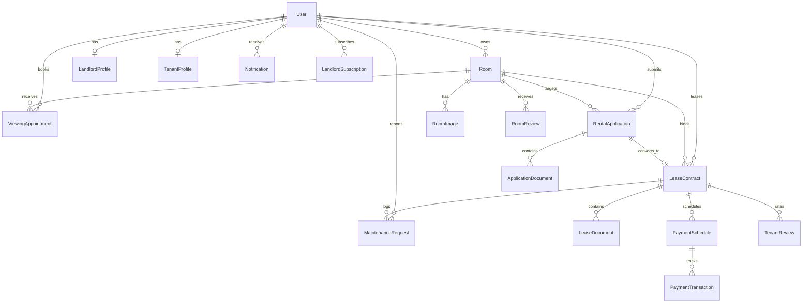
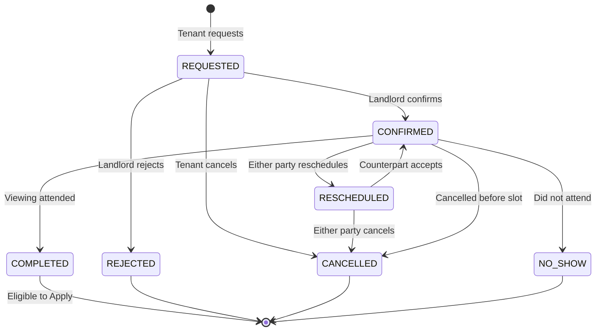
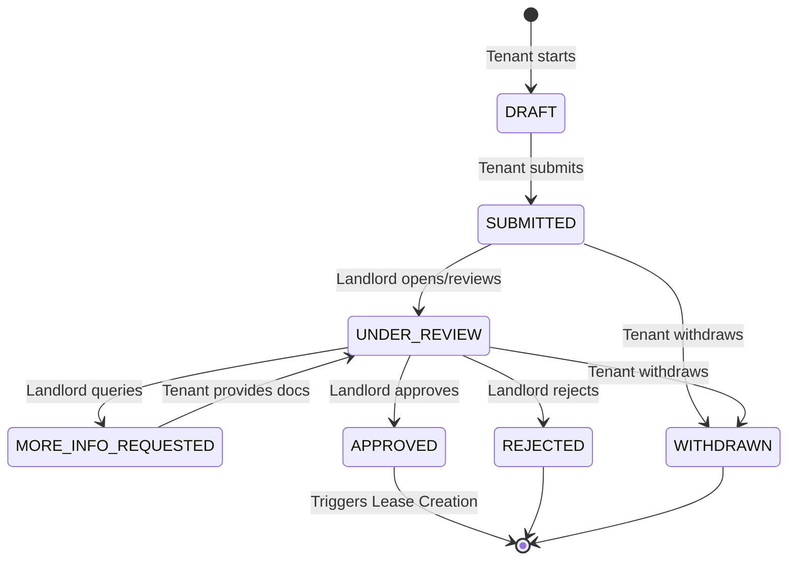
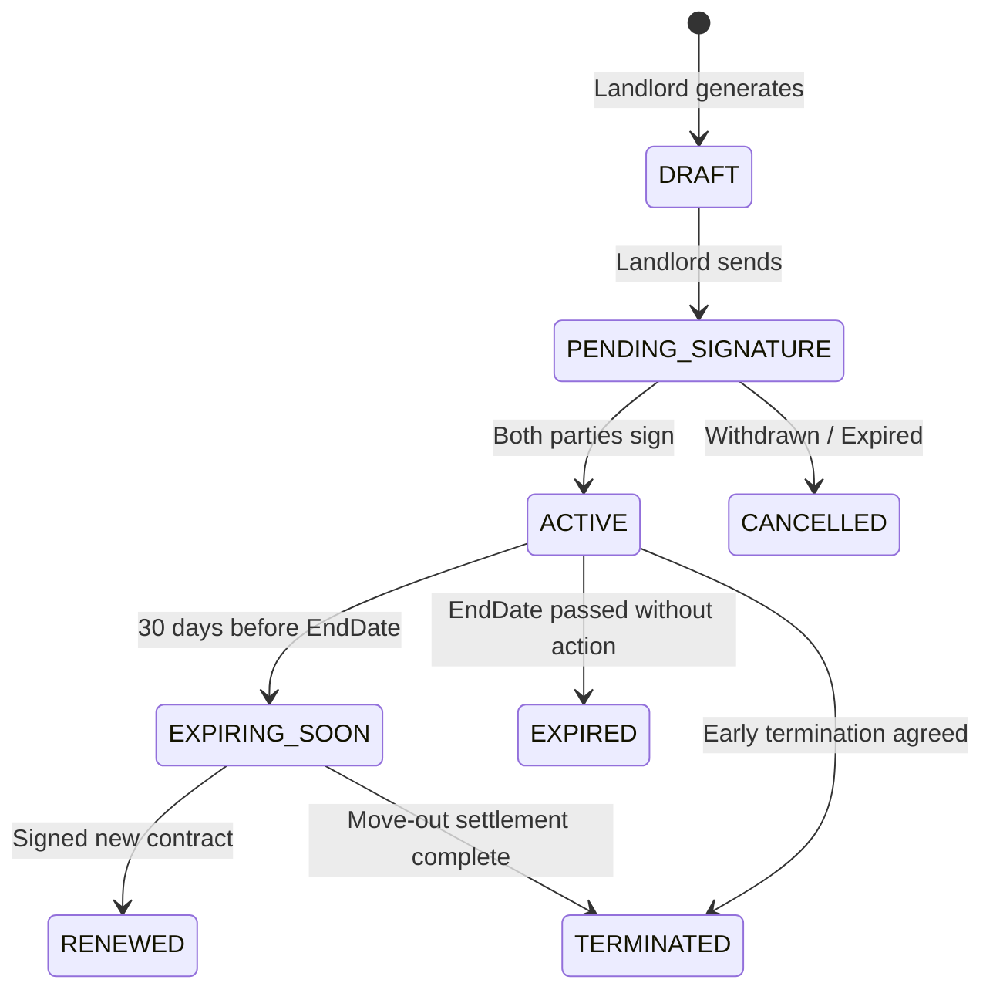
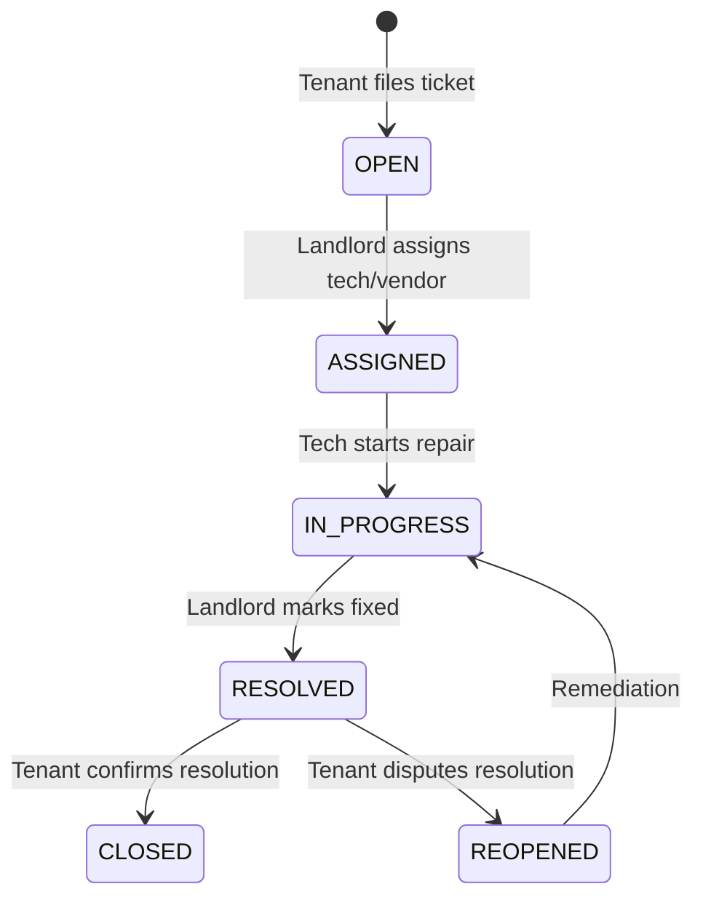
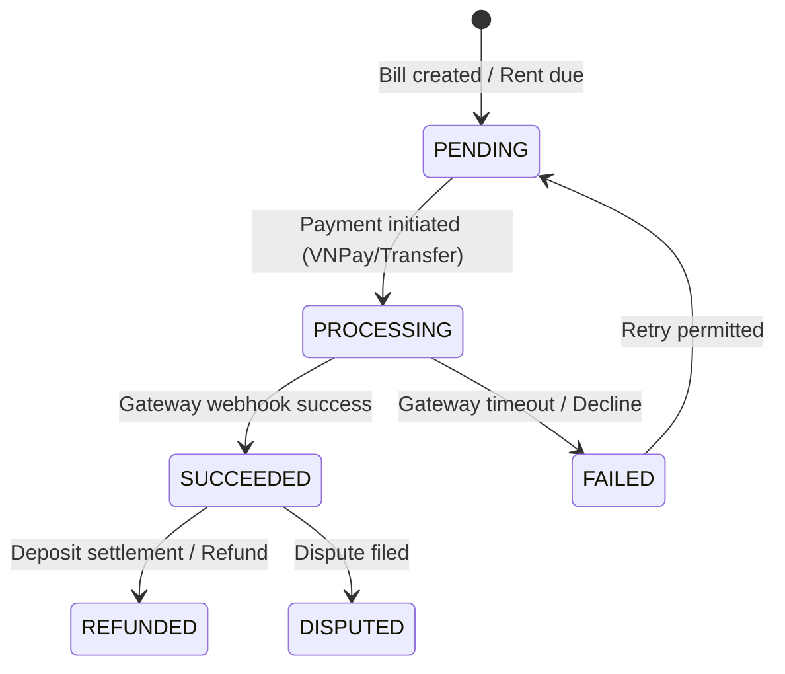

# DORMI — Sprint 1: Product Restructuring Specification

## 1. Product Positioning & Strategy

### 1.1 Core Statement
> **"DORMI helps tenants find trustworthy rental properties and helps landlords convert and manage tenants more efficiently."**

DORMI is neither a generic classifieds board nor an unfocused lifestyle app. DORMI is an **Integrated Rental Marketplace & Landlord Operating System powered by a Trust & Transaction Spine**.

```
                    DORMI
                      │
        ┌─────────────┴─────────────┐
        │                           │
     TENANT                    LANDLORD
   Find & Rent              Acquire & Manage
        │                           │
        └───────────┬───────────────┘
                    │
           TRUST + TRANSACTION
```

### 1.2 Anti-Positioning (What DORMI Is NOT)
- **NOT a fragmented classifieds board (Phòng trọ 123 / Chợ Tốt clone):** We do not stop at displaying phone numbers. The transaction happens on DORMI.
- **NOT an AI toy app:** No speculative AI features without high-utility user problems.
- **NOT a roommate-first app:** Roommate matching is strictly a tenant acquisition feature and lifestyle hook, subordinate to property renting.
- **NOT a payment gateway company:** Payments serve tenant obligation tracking and landlord SaaS monetization, not high-frequency peer-to-peer wallet transfers.
- **NOT an over-engineered microservices cluster:** Modular monolith on ASP.NET Core with PostgreSQL, PostGIS, Redis, and Kafka.

---

## 2. Product Hierarchy & Feature Priority Matrix

### 2.1 Feature Priority

| Tier | Focus Area | Features Included | Primary Metric Impact |
| :--- | :--- | :--- | :--- |
| **P0 (Must-Have)** | **Core Spine** | • Smart Search & Geolocation (PostGIS)<br>• Verified Listing & Details<br>• Favorites & In-app Chat<br>• Viewing Scheduling Lifecycle<br>• Rental Application System<br>• Landlord Application Review & Approval<br>• Lease Creation & Signature<br>• Trust & Identity Verification (CCCD/Property)<br>• In-app & Real-time Notifications (SignalR)<br>• Basic Landlord Lead CRM | **Transaction Completion Rate** |
| **P1 (Should-Have)** | **Lifecycle & Monetization** | • Dual-Rail Payment Tracking (Rent/Deposit vs. Landlord Subscriptions)<br>• Maintenance Ticket Engine<br>• Lease Renewal & Move-Out Flow<br>• Deposit Settlement<br>• Landlord & Tenant Two-way Reviews<br>• Dispute & Violation Reporting<br>• Funnel Analytics & Listing Boosts | **Retention & MRR** |
| **P2 (Later / Post-Traction)**| **Optimization & Scale** | • AI Recommendations & Smart Matching<br>• Automated Image Fraud Detection<br>• Pricing Predictor<br>• Distributed Job Workers Optimization<br>• Microservices decomposition (only when traffic justifies) | **Operational Efficiency** |

---

## 3. End-to-End User Journeys & "Next-Action" UX

### 3.1 Tenant End-to-End Journey
1. **Discover**: Search listings by location, budget, amenities, university proximity.
2. **Evaluate**: View room details, inspection scores, verified landlord badge, 360/photo gallery.
3. **Engage**: Inquire via chat or book a viewing directly.
4. **Viewing**: Select date/time slot $\rightarrow$ Landlord confirms $\rightarrow$ Tenant attends $\rightarrow$ Marks completed.
5. **Apply**: Submit comprehensive Rental Application (Identity, income proof, occupants, target move-in date).
6. **Lease**: Landlord approves $\rightarrow$ Draft Lease generated $\rightarrow$ Tenant reviews terms & signs.
7. **Move-in & Living**: Pay initial deposit/rent $\rightarrow$ Submit maintenance tickets when issues arise $\rightarrow$ Track monthly dues.
8. **Off-boarding**: Request renewal OR Initiate move-out $\rightarrow$ Checkout inspection $\rightarrow$ Deposit settlement $\rightarrow$ Leave review.

### 3.2 Landlord End-to-End Journey
1. **Onboard**: Register $\rightarrow$ Submit identity & ownership proof (CCCD, title / delegation doc).
2. **Publish**: Create listing with validated geo-location, pricing, amenities, room inventory.
3. **Lead Capture**: Monitor incoming leads across the CRM funnel (`Inquiry` $\rightarrow$ `Viewing` $\rightarrow$ `Application`).
4. **Schedule Viewing**: Accept, reschedule, or complete viewing sessions.
5. **Vet Applicants**: Review tenant background, employment, rental history, and reputation score $\rightarrow$ Request info or Approve.
6. **Contracting**: Create and customize digital lease $\rightarrow$ Send for electronic sign-off.
7. **Operations**: Track rent collection status $\rightarrow$ Resolve maintenance tickets $\rightarrow$ Handle move-out inspection.

### 3.3 The "Next-Action" Principle
Every screen must have an unambiguous primary next action. Dead-ends are prohibited.

| Screen | Primary Next Action | Secondary Action |
| :--- | :--- | :--- |
| **Room Detail** | `[Request Viewing]` (or `[Apply Now]`) | `[Chat with Landlord]`, `[Save]` |
| **Viewing Confirmed** | `[Add to Calendar]` / `[Directions]` | `[Reschedule]`, `[Cancel]` |
| **Viewing Completed** | `[Submit Rental Application]` | `[Browse Similar Rooms]` |
| **Application: Under Review**| `[View Landlord Activity]` | `[Add Supporting Document]` |
| **Application: Approved** | `[Review & Sign Lease]` | `[Contact Landlord]` |
| **Active Lease Dashboard** | `[Pay Upcoming Rent]` / `[Report Maintenance]` | `[View Contract PDF]` |
| **Maintenance: In Progress** | `[Confirm Resolution]` | `[Message Technician]` |

---

## 4. Business Model & Dual-Rail Financial Architecture

### 4.1 Marketplace Flywheel
```
Tenant Demand (Trustworthy Listings & Frictionless Apply)
       │
       ▼
Landlord Lead Conversion & Low Vacancy
       │
       ▼
Landlord Willingness to Pay for Operations & Visibility
       │
       ▼
DORMI Revenue (SaaS Subscriptions + Promotion Boosts)
       │
       ▼
Reinvestment in Platform Trust, Verification & Tenant Acquisition
       ↺ (Flywheel accelerates)
```

### 4.2 Dual-Rail Financial Flows
We strictly decouple rental obligations from DORMI platform revenues:

```
[ RAIL A: Rental Transactions ]            [ RAIL B: DORMI Monetization ]
Tenant ───► Landlord                       Landlord ───► DORMI
• Monthly Rent                             • SaaS Subscriptions (Free / Pro / Biz)
• Security Deposit                         • Listing Boosts (24h / 3d / 7d)
• Utility Charges                          • Featured Placements
• Late Fees                                • Identity Verification Expedite
```

### 4.3 Landlord Monetization Tiers (Design Specification)

| Feature / Limit | Free Tier (0 VND) | Pro Tier (~299k VND/mo) | Business Tier (~799k - 1.5M VND/mo) |
| :--- | :--- | :--- | :--- |
| **Active Listings** | Up to 2 listings | Up to 15 listings | Unlimited listings |
| **Applications & CRM** | Basic | Advanced Lead Funnel & Filtering | Full Multi-property CRM |
| **Tenant Verification** | Basic badge check | Priority reputation insights | Comprehensive background scoring |
| **Listing Analytics** | Views count | Full Conversion Funnel & Lead metrics | Aggregated Portfolio Intelligence |
| **Sub-accounts / Staff** | 1 user | 1 user | Multi-agent role management |
| **Included Boosts** | None | 1 boost per month included | 5 boosts per month included |

---

## 5. Domain Model & ERD Architecture



---

## 6. Formal State Machines

### 6.1 Viewing State Machine (`ViewingAppointment`)



**Transition Rules Table:**
| Current State | Event | Target State | Actor | Invariant / Guard Condition |
| :--- | :--- | :--- | :--- | :--- |
| *None* | `RequestViewing` | `REQUESTED` | Tenant | Room is `Available`; Date > now. |
| `REQUESTED` | `ConfirmViewing` | `CONFIRMED` | Landlord | Slot is open without conflict. |
| `REQUESTED` | `RejectViewing` | `REJECTED` | Landlord | Rejection reason optional. |
| `REQUESTED` | `CancelViewing` | `CANCELLED` | Tenant | Can cancel any pending request. |
| `CONFIRMED` | `Reschedule` | `RESCHEDULED` | Either | New proposed date required. |
| `RESCHEDULED`| `AcceptReschedule`| `CONFIRMED` | Other Party | Must be in future. |
| `CONFIRMED` | `MarkCompleted` | `COMPLETED` | Either / Auto | Slot time has passed. Unlocks application prompt. |
| `CONFIRMED` | `MarkNoShow` | `NO_SHOW` | Landlord | Slot time passed, tenant failed to appear. |

---

### 6.2 Rental Application State Machine (`RentalApplication`)



**Transition Rules Table:**
| Current State | Event | Target State | Actor | Invariant / Guard Condition |
| :--- | :--- | :--- | :--- | :--- |
| `DRAFT` | `Submit` | `SUBMITTED` | Tenant | Required fields filled (Income, Occupants, MoveInDate). |
| `SUBMITTED` | `BeginReview` | `UNDER_REVIEW` | Landlord | Notifies tenant landlord is reviewing. |
| `UNDER_REVIEW` | `RequestInfo` | `MORE_INFO_REQUESTED` | Landlord | Note specified with missing info. |
| `MORE_INFO_REQUESTED`| `ProvideInfo`| `UNDER_REVIEW` | Tenant | Additional doc or message submitted. |
| `UNDER_REVIEW` | `Approve` | `APPROVED` | Landlord | Room status reserved; unlocks Lease Generation. |
| `UNDER_REVIEW` | `Reject` | `REJECTED` | Landlord | Application closed. |
| Any open | `Withdraw` | `WITHDRAWN` | Tenant | Only before lease activation. |

---

### 6.3 Lease State Machine (`LeaseContract`)



**Transition Rules Table:**
| Current State | Event | Target State | Actor | Invariant / Guard Condition |
| :--- | :--- | :--- | :--- | :--- |
| *None* | `CreateLease` | `DRAFT` | Landlord | Bound to Approved Application & Room. |
| `DRAFT` | `SendForSignature` | `PENDING_SIGNATURE`| Landlord | Terms, dates, rent, and deposit populated. |
| `PENDING_SIGNATURE` | `Sign` | `ACTIVE` | Tenant + Landlord | Both signatures validated. Room marked `Rented`. |
| `ACTIVE` | `SystemCronExpiring` | `EXPIRING_SOON` | System | $T \le 30$ days to `EndDate`. Alerts both parties. |
| `EXPIRING_SOON` | `Renew` | `RENEWED` | Both | Spawns successor lease record. |
| `EXPIRING_SOON` | `CompleteMoveOut` | `TERMINATED` | Both | Move-out inspection & deposit resolved. |
| `ACTIVE` | `EarlyTerminate` | `TERMINATED` | Both / Admin | Mutual agreement or default protocol. |

---

### 6.4 Maintenance Request State Machine (`MaintenanceRequest`)



---

### 6.5 Payment & Settlement State Machine (`PaymentTransaction`)



---

## 7. Execution Roadmap (Sprint 1 to Sprint 8)

- **Sprint 1: Product Restructuring** (THIS SPRINT)
  - [x] Product positioning & Anti-positioning
  - [x] End-to-end user journeys & Next-Action UX model
  - [x] Dual-rail business model & monetization strategy
  - [x] P0/P1/P2 feature priority matrix
  - [x] Entity-relationship domain architecture
  - [x] Formal state machine specifications
  - [x] C# Domain Enums & Model foundations in backend
- **Sprint 2: Transaction Spine (Viewing & Application)** (COMPLETED)
  - [x] Full Viewing appointment overhaul (all 7 statuses, rescheduling, feedback).
  - [x] Rental Application entities, APIs, and multi-step Tenant application wizard.
  - [x] Landlord Application Review dashboard (Profile review, Approve, Reject, Request Info).
  - [x] Next-action integration on RoomDetail and Viewing completed states.
- **Sprint 3: Lease Lifecycle & Inventory Sync** (COMPLETED)
  - [x] LeaseContract domain entity upgrade with `LeaseDocument` support and `RentalApplication` link.
  - [x] Backend `LeaseService` and `LeasesController` with role checks, digital signature execution, and contract termination.
  - [x] Real-time inventory synchronization: Room switches to `Rented` upon tenant signature and reverts to `Available` upon termination.
  - [x] Frontend `TenantLeases` page (`/tenant/leases`) with e-signature modal and tenant dashboard.
  - [x] Frontend `LandlordLeases` page (`/landlord/leases`) with pre-filled contract creation from approved applications.
  - [x] Navigation wiring across layouts, routes, and dashboards.
  - [x] Unit tests for full lease lifecycle (32 passing tests).
- **Sprint 4: Landlord Monetization & CRM Funnel** (NEXT SPRINT)
  - Landlord tiered plans (Free, Pro, Business) and Listing Boost promotions.
  - Landlord Lead & Funnel Analytics dashboard (`Views` $\rightarrow$ `Leads` $\rightarrow$ `Viewings` $\rightarrow$ `Applications` $\rightarrow$ `Leases`).
- **Sprint 5: Post-Rental Lifecycle (Rent Payments, Maintenance & Move-out)**
  - Tenant obligation tracking (Rent, Deposit) vs Landlord Platform billing.
  - Maintenance request ticketing system (Open, In Progress, Resolved, Closed).
  - Lease renewal and move-out checkout / deposit settlement.
- **Sprint 6: Trust & Safety System**
  - Identity verification and property ownership validation.
  - Transparent Trust Score engine with explainability breakdown.
  - Moderation queue, reports, and disputes.
- **Sprint 7: Intelligence (Targeted & Practical)**
  - Targeted roommate matchmaking integration (secondary module).
  - Landlord tenant-discovery based on search criteria.
- **Sprint 8: Scale & Production Hardening**
  - Redis cache-aside & distributed locking refinement.
  - Kafka consumer resiliency and audit trail.
  - Observability, performance tuning, and final deployment.
